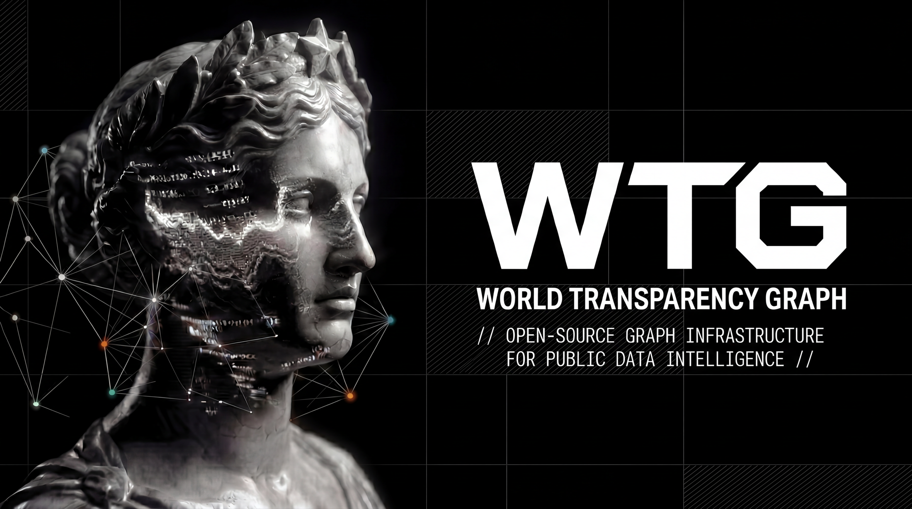

# World Transparency Graph (WTG) — Icarus Core

Global public-data graph analysis platform.

[](docs/brand/wtg-header.png)

[](https://github.com/brunoclz/world-transparency-graph/actions/workflows/ci.yml)
[](https://www.gnu.org/licenses/agpl-3.0)

---

## What it is

WTG (powered by Icarus Core) ingests public records and enables visual exploration of connections between companies, contracts, elections, and sanctions.

**Data patterns from public records. Not accusations.**

## Brand model

- Public product: **World Transparency Graph (WTG)**
- Civic movement: **BRCC**
- Advanced engine: **Icarus Core**

Public edition boundary reference: [docs/brand/open_core_boundary.md](docs/brand/open_core_boundary.md)

## Architecture

```
┌─────────────┐     ┌──────────────┐     ┌──────────────┐
│  Frontend   │────▶│   FastAPI     │────▶│    Neo4j     │
│  React SPA  │     │   REST API    │     │  Graph DB    │
│  :3000      │     │   :8000       │     │  :7687       │
└─────────────┘     └──────────────┘     └──────────────┘
                           ▲
                    ┌──────┴──────┐
                    │  ETL Pipes  │
                    │  CNPJ, TSE  │
                    │  Transp,    │
                    │  Sanctions  │
                    └─────────────┘
```

| Layer | Technology |
|---|---|
| Graph DB | Neo4j 5 Community |
| Backend | FastAPI (Python 3.12+, async) |
| Frontend | Vite + React 19 + TypeScript |
| ETL | Python (pandas, httpx) |
| Entity Resolution | splink 4 (optional) |
| Infra | Docker Compose |
| i18n | EN (default), PT-BR |

## Quick start

```bash
# Prerequisites: Docker, Node 22+, Python 3.12+, uv
cp .env.example .env
# Edit .env with your Neo4j password

# Start full stack
make dev

# Load development seed data
export NEO4J_PASSWORD=your_password
make seed

# API: http://localhost:8000/health
# Frontend: http://localhost:3000
# Neo4j Browser: http://localhost:7474
```

## Development

```bash
# Install dependencies
cd api && uv sync --dev
cd etl && uv sync --dev
cd frontend && npm install

# Run individual services
make api           # FastAPI with hot reload
make frontend      # Vite dev server

# ETL
cd etl && uv run icarus-etl sources   # List pipelines
cd etl && uv run icarus-etl run --source cnpj --neo4j-password $NEO4J_PASSWORD

# Quality checks (run before commit)
make check         # lint + types + tests
make neutrality    # prohibited-word audit
```

## Tests

```bash
make test          # All (API + ETL + Frontend)
make test-api      # Python API tests
make test-etl      # Python ETL tests
make test-frontend # TypeScript frontend tests
```

## Analysis patterns

| ID | Pattern |
|---|---|
| p01 | Self-dealing amendment |
| p05 | Patrimony incompatibility |
| p06 | Sanctioned still receiving |
| p10 | Donation-contract loop |
| p12 | Contract concentration |

## Public mode contract

WTG Open should run with the following safe defaults:

- `PRODUCT_TIER=community`
- `PUBLIC_MODE=true`
- `PUBLIC_ALLOW_PERSON=false`
- `PUBLIC_ALLOW_ENTITY_LOOKUP=false`
- `PUBLIC_ALLOW_INVESTIGATIONS=false`

With these defaults, public mode does not return personal-entity nodes (`Person`/`Partner`) or personal document properties.

## Commercial offerings

WTG Open is public and auditable.  
Icarus Advanced is specialized and not included in this repository.

Advanced offerings include:

- Advanced entity-resolution precision modules
- Advanced scoring and high-sensitivity pattern intelligence
- Managed deployment and operational support

## Legal & Ethics

- [ETHICS.md](ETHICS.md)
- [LGPD.md](LGPD.md)
- [PRIVACY.md](PRIVACY.md)
- [TERMS.md](TERMS.md)
- [DISCLAIMER.md](DISCLAIMER.md)
- [SECURITY.md](SECURITY.md)
- [ABUSE_RESPONSE.md](ABUSE_RESPONSE.md)
- [docs/legal/legal-index.md](docs/legal/legal-index.md)

## API endpoints

| Method | Route | Description |
|---|---|---|
| GET | `/health` | Health check |
| GET | `/api/v1/public/meta` | Aggregated metrics and source health |
| GET | `/api/v1/public/patterns/company/{cnpj_or_id}` | Public risk signals for a company |
| GET | `/api/v1/public/graph/company/{cnpj_or_id}` | Public company subgraph |

### Advanced-only surface (internal deployment)

- `/api/v1/entity/*`
- `/api/v1/search`
- `/api/v1/graph/*`
- `/api/v1/patterns/*`
- `/api/v1/investigations/*`

## Project structure

```
CORRUPTOS/
├── api/                  # FastAPI backend
│   ├── src/icarus/
│   │   ├── routers/      # 7 routers
│   │   ├── services/     # Business logic
│   │   ├── queries/      # 27 .cypher files
│   │   ├── models/       # Pydantic models
│   │   └── middleware/   # CPF masking
│   └── tests/            # 79 unit tests
├── etl/                  # ETL pipelines
│   ├── src/icarus_etl/
│   │   ├── pipelines/    # CNPJ, TSE, transparency, sanctions
│   │   ├── transforms/   # Name norm, doc formatting, dedup
│   │   └── linking hooks  # Community/public-safe post-load hooks
│   └── tests/            # 63 unit tests
├── frontend/             # React SPA
│   └── src/
│       ├── components/   # Graph, Entity, Search, Pattern, Investigation
│       ├── pages/        # Home, Search, GraphExplorer, Patterns, Investigations
│       └── stores/       # Zustand
├── infra/                # Docker Compose + Neo4j schema + seed data
└── .github/workflows/    # CI pipeline
```

## License

[GNU Affero General Public License v3.0](LICENSE)
